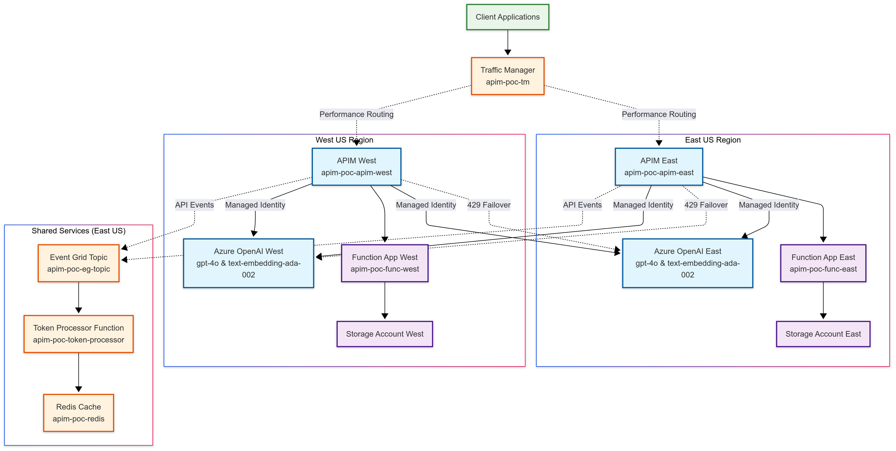

# Multi-Region Azure API Management with OpenAI Integration

## Overview

This repository contains a **Proof of Concept (POC)** for implementing a multi-region Azure API Management (APIM) solution with Azure OpenAI integration. The solution provides high availability, automatic failover, geo-conditional access, comprehensive token usage tracking, and intelligent load balancing across multiple Azure regions.

## Key Features

- 🌍 **Multi-Region Deployment**: East US and West US regions for high availability
- 🤖 **Azure OpenAI Integration**: GPT-4o and text-embedding-ada-002 models in both regions
- 🔄 **Intelligent Load Balancing**: Geographic routing with performance-based traffic management
- 🛡️ **Automatic Failover**: 429 rate limit handling with regional fallback
- 📊 **Token Usage Tracking**: Real-time monitoring via Event Grid and Redis
- 🔒 **Managed Identity Security**: Secure authentication between services
- ⚡ **Serverless Functions**: Python-based Azure Functions for API backends and event processing
- 🏗️ **Infrastructure as Code**: PowerShell-based provisioning with command echoing

## Architecture Diagram


## Solution Components

### Core Infrastructure

| Component | Purpose | Deployment |
|-----------|---------|------------|
| **Traffic Manager** | Global load balancing and failover | Performance-based routing |
| **APIM Instances** | API gateway with policies | East US & West US |
| **Azure OpenAI** | AI model hosting | Both regions with same models |
| **Function Apps** | Serverless API backends | Linux/Python runtime |
| **Event Grid** | Event-driven architecture | Token usage tracking |
| **Redis Cache** | High-performance data store | Usage analytics and caching |

### Advanced Features

- **Geo-Conditional Access**: Automatic routing based on client geography
- **Circuit Breaker Pattern**: Intelligent failover on 429 rate limits
- **Token Usage Analytics**: Real-time tracking with Event Grid events
- **Managed Identity Integration**: Secure service-to-service authentication
- **Query Parameter Stripping**: Clean API calls with metadata preservation

## Repository Structure

```
PROS/
├── README.md                              # This documentation
├── provision-multiregion-apim.ps1        # Main provisioning script
├── Provision/
│   ├── provision-multiregion-apim.ps1   # Enhanced provisioning script
│   └── Post-Provision/                   # Configuration files
│       ├── apim-openai-geo-loadbalance-policy.xml  # Advanced APIM policy
│       ├── eventgrid-function.py         # Event Grid trigger function
│       ├── openai-backend-function.py    # OpenAI proxy function
│       ├── configure-apim-backends.ps1   # Backend configuration script
│       ├── requirements.txt              # Python dependencies
│       └── bean_counter/                 # Token usage processing
│           ├── eventgrid-function.py
│           ├── function_app.py
│           ├── host.json
│           └── requirements.txt
└── Accountant/
    └── bean_counter.py                   # Standalone token counter
```

## Quick Start

### Prerequisites

- Azure CLI installed and configured
- PowerShell 7+ 
- Azure subscription with Contributor rights
- Azure OpenAI access enabled in target regions

### Deployment

1. **Clone the repository**:
   ```powershell
   git clone <repository-url>
   cd PROS
   ```

2. **Run the provisioning script**:
   ```powershell
   ./Provision/provision-multiregion-apim.ps1 -baseName "your-poc-name"
   ```

3. **Configure APIM backends** (after provisioning completes):
   ```powershell
   ./Provision/Post-Provision/configure-apim-backends.ps1
   ```

4. **Deploy Function code**:
   - Deploy `openai-backend-function.py` to both Function Apps
   - Deploy `eventgrid-function.py` to the token processor Function

5. **Apply APIM policies**:
   - Import the provided XML policies into your APIM operations
   - Update endpoint URLs with your actual OpenAI endpoints

## Configuration Details

### APIM Policy Features

The advanced APIM policy (`apim-openai-geo-loadbalance-policy.xml`) provides:

- **Geographic Routing**: Determines optimal region based on client location
- **Load Balancing**: Distributes requests across available endpoints
- **Failover Logic**: Automatically switches regions on 429 responses
- **Event Generation**: Sends usage data to Event Grid for tracking
- **Circuit Breaker**: Protects against cascading failures

### Event Grid Integration

Token usage tracking workflow:
1. APIM strips query parameters (username, companyName, billingCode)
2. API call disposition sent to Event Grid topic
3. Event Grid triggers token processor Function
4. Usage data stored in Redis for analytics

### Security Implementation

- **Managed Identities**: APIM instances use managed identities for OpenAI access
- **RBAC**: "Cognitive Services OpenAI Contributor" role assignments
- **Connection Strings**: Secure storage in Function App settings
- **SSL/TLS**: All communications encrypted in transit

## Monitoring and Analytics

### Token Usage Tracking

- Real-time usage data in Redis
- Event-driven processing via Event Grid
- Support for multi-tenant billing codes
- Historical usage analytics

### Health Monitoring

- Traffic Manager health probes
- APIM built-in analytics
- Function App monitoring via Application Insights
- Redis cache metrics

## Troubleshooting

### Common Issues

1. **APIM Creation Timeout**: APIM provisioning can take 45+ minutes
2. **OpenAI Model Deployment**: Ensure sufficient quota in target regions
3. **Managed Identity Permissions**: Verify RBAC assignments are applied
4. **Function App Cold Start**: First requests may have higher latency

### Diagnostic Commands

```powershell
# Check APIM status
az apim show --name "your-apim-name" --resource-group "your-rg" --query "provisioningState"

# Verify OpenAI deployments
az cognitiveservices account deployment list --name "your-openai-name" --resource-group "your-rg"

# Test Function App
az functionapp show --name "your-function-name" --resource-group "your-rg" --query "state"
```

## Cost Optimization

- **APIM Developer Tier**: Suitable for POC/development
- **Consumption Plan Functions**: Pay-per-execution model
- **Standard Redis**: Balanced performance and cost
- **Traffic Manager**: Minimal cost for DNS-based routing

## Next Steps

1. **Production Readiness**: Upgrade to APIM Standard/Premium for SLA
2. **Security Hardening**: Implement private endpoints and VNet integration
3. **Monitoring Enhancement**: Add Application Insights and custom dashboards
4. **Load Testing**: Validate failover behavior under load
5. **CI/CD Pipeline**: Automate deployment and configuration updates

## Contributing

When contributing to this project:

1. Test all changes in a development environment
2. Update documentation for any architectural changes
3. Ensure PowerShell scripts maintain command echoing functionality
4. Validate Mermaid diagram accuracy after modifications

## License

This is a proof-of-concept project for educational and demonstration purposes.

---

**Note**: Remember to update placeholder values in the configuration files with your actual Azure resource endpoints and identifiers before deployment.
